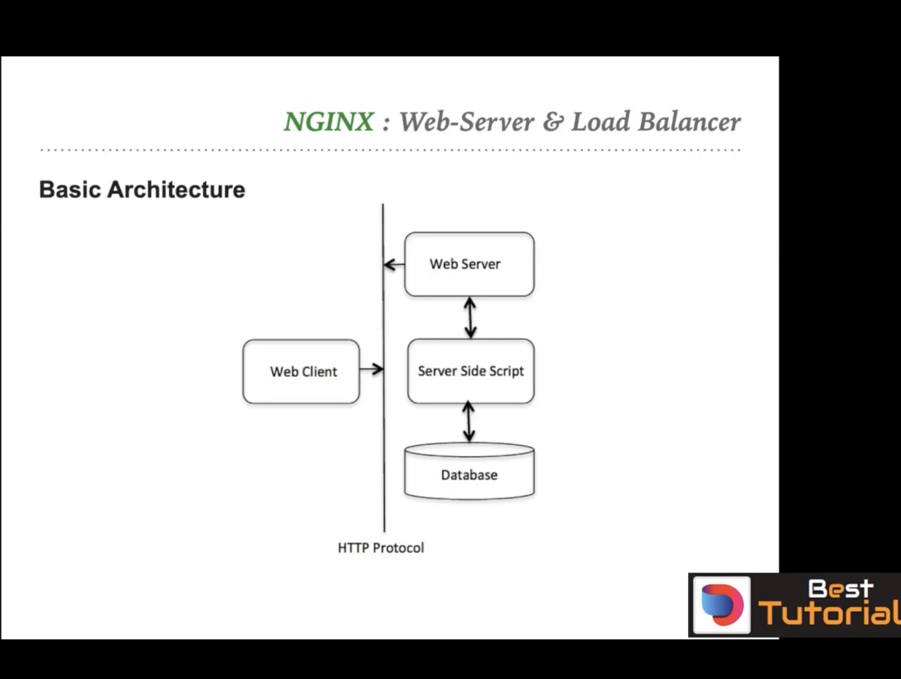

## HTTP Protocol

`HTTP (Hypertext Transfer Protocol)` is a protocol which allows the fetching of resources, such as HTML documents. It is the foundation of any data exchange on the Web and it is a client-server protocol, which means requests are initiated by the recipient, usually the Web browser. A complete document is reconstructed from the different sub-documents fetched, for instance text, layout description, images, videos, scripts, and more.

    - HTTP is an application-level protocol for distributed, colloborative, hypermdedia information systems.
    - HTTP is a TCP/IP based communication protocol, that is used to deliver data (HTML files, image files, query results, etc.) on the World Wide Web`
    - HTTP is a `stateless` protocol, which means that the server does not keep any data (state) between two requests. Web applications that require state need to implement it themselves.

    - HTTP specificatuon specifies how clients request data will be constructed and how servers respond to these requests. It also specifies how the requested data will be transmitted.


#### Basics features of HTTP
 - HTTP is `connectionless` because the `client` and `server` are only connected for the duration of a request. Afterwards, they disconnect from each other`
 - The server processes the request and sends a response back to the client. The client then disconnects from the server. The connection between the client and server is closed after the response is sent. The client and server are independent of each other for the rest of the transaction.
 - `HTTP is media independent`. This means that any type of data can be sent by HTTP as long as both the client and the server know how to handle the data content. HTTP is capable of transmitting any type of data, not just HTML. HTTP is also used to transmit images, videos, files, and so on (see MIME types).
 - `HTTP is stateless`, but not sessionless. The server is not required to remember any previous request from the client. However, it can remember the session information.


#### Basic Architecture of HTTPS

- `HTTP Client`: The HTTP client sends a request to the server in the form of a request method, URI, and protocol version, followed by a MIME-like message containing request modifiers, client information, and possible body content over a connection with a server.
- `HTTP Server`: The HTTP server responds with a status line, including the message's protocol version and a success or error code, followed by a MIME-like message containing server information, entity metainformation, and possible entity-body content.
- `HTTP Proxy`: A proxy server is a server that acts as an intermediary for requests from clients seeking resources from other servers. A client connects to the proxy server, requesting some service, such as a file, connection, web page, or other resource available from a different server and the proxy server evaluates the request as a way to simplify and control its complexity. Proxies were invented to add structure and encapsulation to distributed systems.
- `HTTP Cache`: A web cache (or HTTP cache) is an information technology for the temporary storage (caching) of web documents, such as HTML pages and images, to reduce bandwidth usage, server load, and perceived lag. A web cache system stores copies of documents passing through it; subsequent requests may be satisfied from the cache if certain conditions are met.
- `HTTP Gateway`: A gateway server is a network node that connects two networks using different protocols together. While a bridge is used to join two similar types of networks, a gateway is used to join two dissimilar networks.
- `Server-side Scripting`: Server-side scripting is a technique used in web development which involves employing scripts on a web server which produce a response customized for each user's (client's) request to the website. The alternative is for the web server itself to deliver a static web page.
- `Database`: A database is an organized collection of data, generally stored and accessed electronically from a computer system. Where databases are more complex they are often developed using formal design and modeling techniques.


#### HTTP Request Type 

HTTP Request is send by client to server to get data in the below format:

```bash
    <HTTP VERB> <URL> <HTTP VERSION>
    <HEADERS>
    <BODY>
```
HTTP client sends and HTTP request to a server in form of a request message which contains :
  - A Request-line
  - A zero or  `Headers`: The headers contain additional information about the request message. For example, the type of the body of the request message, authorization information, type of the client, etc.
  - An empty line (i.e., a line with nothing preceding the CRLF) indicating the end of the header fields
  - An optional message body.  `Body`: The body of the request message contains the data associated with the request. For example, the content of an HTML form, or the JSON data.
  - `HTTP Method`: The HTTP method is a request type that indicates the desired action to be performed on the identified resource. For example, GET, POST, PUT, PATCH, DELETE, etc.
  - ` URL`: The URL is the address of the resource on the server. It is the identifier of the resource and how to access it.
  - ` HTTP Version`: The HTTP version is the version of the HTTP protocol used in the request message. For example, HTTP v1.1.

`Reqyest-Line` is the first line of the request message. It contains the HTTP method, URL, and HTTP version. For example, `GET /index.html HTTP/1.1`.
  


#### HTTP Methos

Most common HTTP methods are:
- `GET`: The GET method requests a representation of the specified resource. Requests using GET should only retrieve data and should have no other effect on the data.
- `HEAD`: The HEAD method asks for a response identical to that of a GET request, but without the response body.
- `POST`: The POST method is used to submit an entity to the specified resource, often causing a change in state or side effects on the server.
- `PUT`: The PUT method replaces all current representations of the target resource with the request payload.
- `DELETE`: The DELETE method deletes the specified resource.
- `CONNECT`: The CONNECT method establishes a tunnel to the server identified by the target resource (URI or URL), which is used for requests identified by the Request-URI.
  
Other HTTP methods are:
- `OPTIONS`: The OPTIONS method is used to describe the communication options for the target resource.
- `TRACE`: The TRACE method performs a message loop-back test along the path to the target resource.
- `PATCH`: The PATCH method is used to apply partial modifications to a resource.
- `LINK`: The LINK method establishes one or more relationships between the target resource and a specified resource.
- `UNLINK`: The UNLINK method removes one or more relationships between the target resource and a specified resource.
- `PURGE`: The PURGE method requests that a cache clears any stored representations of the target resource.
- `LOCK`: The LOCK method locks a resource for exclusive access by the client.


#### HTTP Response Codes 

HTTP response is send by server to client to send data in the below format:
```bash
    <HTTP VERSION> <STATUS CODE> <STATUS MESSAGE>
    <HEADERS>
    <BODY>
```

HTTP response is send by server to client to send data in the below format:
  - A Status-line
  - A zero or more header fields followed by CRLF
  - An empty line (i.e., a line with nothing preceding the CRLF) indicating the end of the header fields
  - An optional message body
  - `HTTP Version`: The HTTP version is the version of the HTTP protocol used in the response message. For example, HTTP v1.1.
  - `Status Code`: The status code is a **3-digit integer** result code of the server's attempt to understand and satisfy the request.
  - `Status Message`: The status message is a short textual description of the status code.
  - `Headers`: The headers contain additional information about the response message. For example, the type of the body of the response message, authorization information, type of the client, etc.
  - `Body`: The body of the response message contains the data associated with the response. For example, the content of an HTML form, or the JSON data.

`Status-code` is a 3-digit integer where the first digit of the Status-Code defines the class of response and the last two digits do not have any categorization role. There are 5 values for the first digit:
- `1xx (Informational)`: The request was received, continuing process.
- `2xx (Successful)`: The request was successfully received, understood, and accepted.
- `3xx (Redirection)`: Further action needs to be taken in order to complete the request.
- `4xx (Client Error)`: The request contains bad syntax or cannot be fulfilled.
- `5xx (Server Error)`: The server failed to fulfill an apparently valid request.
- `6xx (Global Failure)`: The request cannot be fulfilled at any server.
- `7xx (Custom Code)`: Custom codes can be used by third-party applications to extend the HTTP/1.1 code set.
